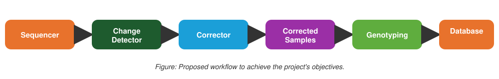

# Allele Correction ML

[](https://www.python.org/downloads/)
[](LICENSE)
[](https://github.com/astral-sh/ruff)

**A two-stage machine learning system that detects and corrects erroneous allele values in DNA sequencer output, improving the reliability of canine genetic identification data.**

---

## Table of Contents

- [Overview](#overview)
- [Key Results](#key-results)
- [Workflow](#workflow)
- [Approach](#approach)
- [Project Structure](#project-structure)
- [Installation](#installation)
- [Usage](#usage)
- [Tech Stack](#tech-stack)
- [License](#license)

---

## Overview

DNA sequencers used for canine genetic identification occasionally return erroneous numerical values for specific alleles due to technical artifacts in the sequencing process. Left uncorrected, these errors propagate into the genotype database and compromise the reliability of identification results.

This project frames the problem as a **two-stage supervised learning pipeline**:

1. **Detection** — a classification model flags allele values likely to be erroneous
2. **Correction** — a regression model estimates the correct value for flagged alleles

The result is an automated, data-driven alternative to manual review of sequencer output, designed to be plugged directly into an existing genotyping workflow.

## Key Results

> To be completed once final evaluation is run.

| Model | Task | Metric | Score |
|---|---|---|---|
| Classifier | Error detection | F1 / Precision / Recall | — |
| Regressor | Value correction | MAE / RMSE | — |

## Workflow



| Stage | Description |
|---|---|
| **Sequencer** | Raw genetic data acquisition |
| **Change Detector** | Classification model flags alleles likely to be erroneous |
| **Corrector** | Regression model corrects the flagged values |
| **Corrected Samples** | Output of the correction stage |
| **Genotyping** | Genotype assignment based on corrected data |
| **Database** | Final storage of validated genetic profiles |

## Approach

The pipeline was built by first profiling the sequencer output to understand the structure and root causes of the errors, which informed the feature engineering strategy used in both modeling stages.

Several classification algorithms were benchmarked for the detection stage, and several regression algorithms for the correction stage, selecting the best-performing model for each task based on cross-validated performance. Model configurations were tuned to squeeze out additional performance once the strongest candidates were identified.

## Project Structure

```
allele-correction-ml/
│
├── data/
│   ├── raw/                  <- Original, immutable sequencer data
│   ├── interim/               <- Intermediate transformed data
│   ├── processed/             <- Final data used for modeling
│   └── external/              <- Data from third-party sources
│
├── notebooks/                 <- Exploration and prototyping notebooks
│
├── allele_correction_ml/      <- Source code
│   ├── config.py                 <- Paths and configuration variables
│   ├── dataset.py                <- Data loading and cleaning
│   ├── features.py               <- Feature engineering
│   ├── plots.py                   <- Visualization utilities
│   └── modeling/
│       ├── train.py               <- Training of classifier and regressor
│       └── predict.py             <- Inference pipeline (classifier → regressor)
│
├── models/                    <- Trained and serialized models
├── reports/
│   └── figures/                <- Generated plots and figures
├── docs/                       <- Project documentation (MkDocs)
├── tests/                      <- Unit tests
│
├── requirements.txt
├── pyproject.toml
└── README.md
```

## Installation

```bash
git clone https://github.com/xigargi/allele-correction-ml.git
cd allele-correction-ml

python -m venv venv
venv\Scripts\activate      # Windows
source venv/bin/activate   # macOS/Linux

pip install -r requirements.txt
```

## Usage

```bash
# Train the classifier (detection model)
python -m allele_correction_ml.modeling.train --model classifier

# Train the regressor (correction model)
python -m allele_correction_ml.modeling.train --model regressor

# Run the full inference pipeline
python -m allele_correction_ml.modeling.predict
```

## Tech Stack

- **Python 3.11**
- **scikit-learn** — classification and regression models
- **pandas / numpy** — data manipulation
- **matplotlib / seaborn** — visualization
- **pytest** — testing
- **ruff** — linting and formatting

## License

This project is licensed under the MIT License — see the [LICENSE](LICENSE) file for details.
